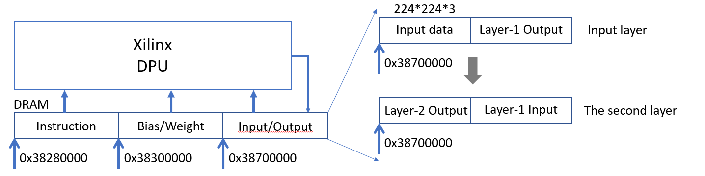
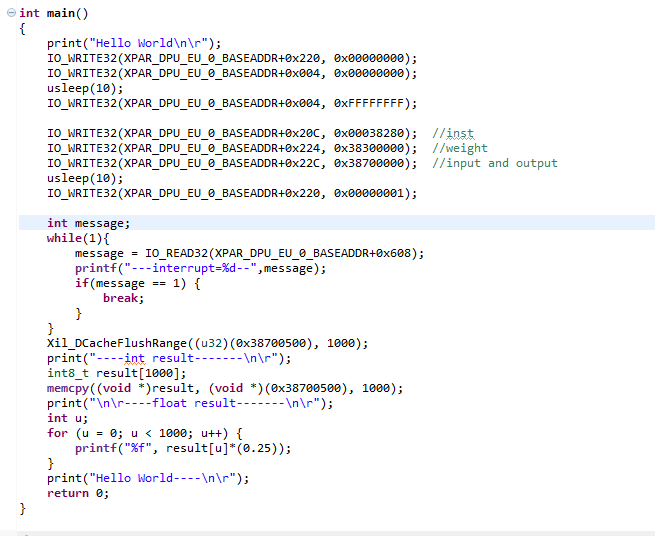
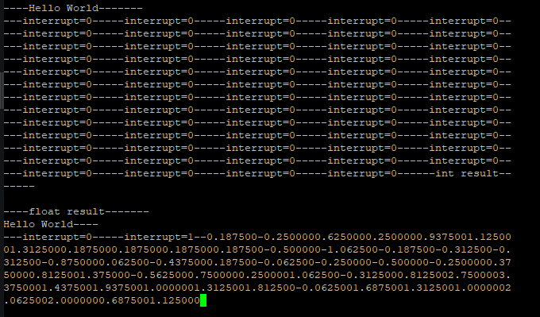

# Xilinx_DPU_Baremetal
The baremetal application for Xilinx DPU. 

## Prerequisites
* Ultra96 V2 platform
* PYNQ 2.4
* Vivado 2018.2
* DPU version: dpu_eu_v3_2_0 (ip folder)

## DPU register 
According to the DPU specification and the analysis of the DPU driver, I found several important registers related to the operation of the DPU. 
| Function | Offset Address | Active Value | IDLE Value |
| :-----:  | :----:  | :----: | :----: |
| Start DPU | 0x220  | 0x0000_0001  | 0x0000_0000 |
| Instruction address on DRAM | 0x20C | -- | -- |
| Weight/Bias address on DRAM | 0x224 | -- | -- |
| Input data  address on DRAM | 0x22C | -- | -- |
| Interrupt (Finish signal)   | 0x608 | 0x0000_0001 | 0x0000_0000 |

## DPU operation flow



As shown in Figure, the DPU read the input data, instruction, and bias/weight parameters from DRAM, and write result back to the DRAM. In addition, the intermediate data is transfered into DRAM algin the input data. For example, the input data address in DRAM is 0x38700000, and the address of the output data in the input layer is after 0x38700000+(150528) 

## Hack DPU step
In this case, I will leverage the mobilenetv2 model as example to show how to obtain the input data, instruction, weight/bias parameters of mobilenetV2 model and deploy it in baremental application.
1. First, you need the Ultra96 V2 platform with PYNQ 2.4 image that support DPU-PYNQ, more details about this configuration can be found in this [link](https://github.com/Xilinx/DPU-PYNQ)

1. Read the input to binary file in PYNQ on Ultra96 V2 platform. In this step, we select the image from ImageNet dataset as input. And we also provide the jupyter notebook and memdump2file to dump the memory content into the file. 

> Run all the block in jupyter notebook and print 'dexplore -s' to determine the memory address.

> Release jupyter notebook, and run the block in jupyter notebook from 1 to X, in this case, you can leverage memdump2file to dump the memory content from input address ```0x78700000``` and the size is ```224*224*3 = 150528 bytes```

3. Read the instruction to binary file in PYNQ on Ultra96 V2 platform. In this step, when you run all the block in jupyter notebook and print 'dexplore -s', you can leverage memdump2file to dump the memory content from instruciton address ```0x78280000 - 0x78300000 ```

4. Read the Bias/Weight to binary file in PYNQ on Ultra96 V2 platform. Similar to step 3, the Bias/Weight parameter address is ```0x78300000 - 0x78700000```

5. Write the input, instruction, and weight/bias binary file to DRAM via Xilinx SDK 2018.2.

> In Xilinx SDK 2018.2, click Xilinx->Dump/Restore Data file, and write input, instruction, and weight/bias binary file to DRAM, the address is ```0x38700000, 0x38280000, and 0x38700000```

6. Write the register of DPU, and read the interrupt register of DPU to check whether the task is completed. 

7. The uart log 

## Author
Shengwen Liang 

State Key Laboratory of Computer Architecture, Institute of Computing Technology, Chinese Academy of Sciences, Beijing; University of Chinese Academy of Sciences.
